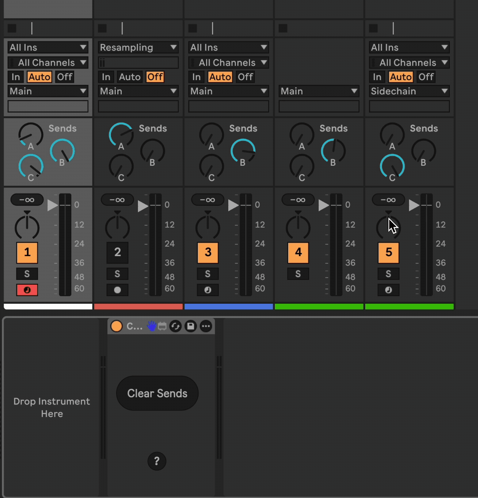

# Clear Sends

This is a Max For Live device that has a button, that when clicked zeroes-out all sends on all tracks.

This was originally asked for by TobyRoc on Reddit in r/ableton.

## Installation

[Download the newest .amxd file from the latest [release](https://github.com/zsteinkamp/m4l-ClearSends/releases).

## Changelog

* 2025-09-02 [v2](https://github.com/zsteinkamp/m4l-ClearSends/raw/main/frozen/ClearSends-v2.amxd) - Make button mappable
* 2025-09-01 [v1](https://github.com/zsteinkamp/m4l-ClearSends/raw/main/frozen/ClearSends-v1.amxd) - Initial release

## Usage

Press the button to set all sends in all tracks to zero. You can use "undo" to reset that.

## TODO

* ...
